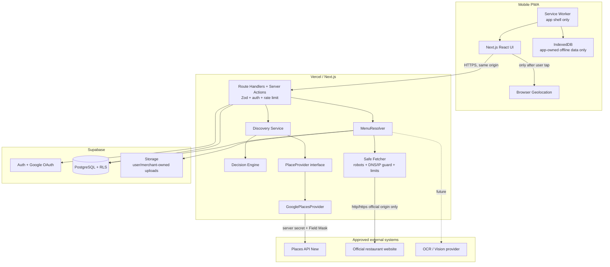
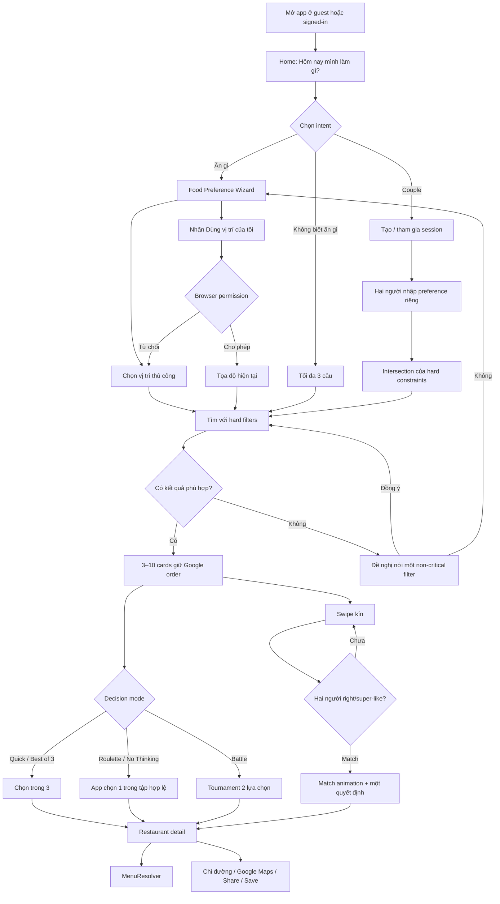
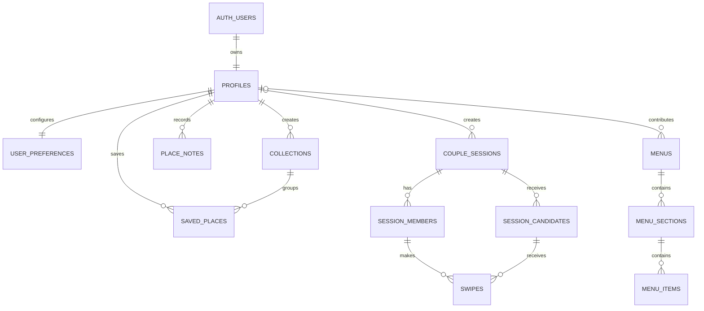
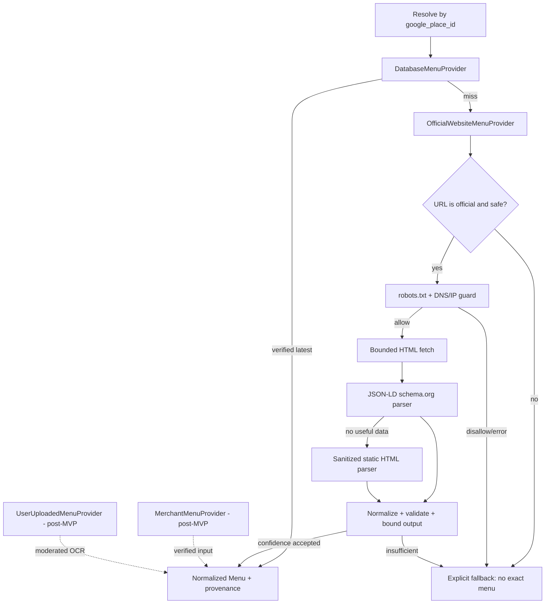

# Product & System Architecture

Cập nhật: 2026-08-29. Tên làm việc: **Đi Đâu Ăn Gì?**

## 1. Product architecture

### Giá trị cốt lõi

Sản phẩm tối ưu cho “đi đến quyết định”, không tối ưu cho thời gian lướt. Luồng chuẩn là: nói nhu cầu → nhận tối đa 3–10 ứng viên tùy mode → quyết định một nơi → mở chỉ đường/chia sẻ. Guest dùng đầy đủ discovery và couple session; đăng nhập chỉ cần khi muốn đồng bộ dài hạn.

### Bounded contexts

| Context | Trách nhiệm | Dữ liệu nguồn |
|---|---|---|
| Discovery | wizard, location, hard filters, empty-state relaxations | input người dùng + Places tạm thời |
| Restaurant | search, detail, photo attribution, Maps deep link | Google Places API (New) |
| Decision | Quick Pick, Roulette, Best of 3, Battle, No Thinking | candidate IDs + lựa chọn người dùng |
| Couple | session code/link, preference intersection, hidden swipe, match | application-owned PostgreSQL |
| Menu | resolve menu theo độ tin cậy, provenance, freshness | app DB / website chính thức / merchant / user |
| Saved & History | collection, notes, visit, chi phí và rating cá nhân | application-owned PostgreSQL |
| Identity | Supabase Auth + Google OAuth + guest token | Supabase + secure HTTP-only cookie |
| Platform | PWA, offline shell, observability, rate limit | service worker + optional vendors |

### Quy tắc dữ liệu và ranking

- Google Rating luôn gắn nhãn **Google rating**. “Độ phù hợp” là logic riêng của ứng dụng và không được trình bày như một Google score.
- Search mặc định giữ nguyên thứ tự Google. Chỉ lọc theo điều kiện người dùng và không sắp xếp lại trong adapter hiện tại.
- `google_place_id` được lưu; nội dung Places khác chỉ tồn tại trong request/response và UI cần thiết. Không mirror tên, rating, review, photo URL hoặc opening hours vào PostgreSQL.
- App-owned menu, note, swipe, collection và preference có thể lưu dài hạn theo chính sách riêng của sản phẩm.
- Trước khi bật custom reranking từ Places Content, cần legal/policy review tại thời điểm release. Nếu chưa có phê duyệt, dùng Google order + user filters.
- Hard constraints như dị ứng/diet và maximum budget không tự nới. Radius/rating chỉ được gợi ý nới và phải ghi rõ thay đổi trước khi gửi search mới.

Chính sách Google hiện hành nêu rõ Places Content không được prefetch/cache/store ngoài ngoại lệ, trong khi Place ID được phép lưu; màn hình không có Google Map phải có Google attribution, và photo/review phải mang attribution tương ứng. Tham chiếu chính thức: [Places policies](https://developers.google.com/maps/documentation/places/web-service/policies), [Place IDs](https://developers.google.com/maps/documentation/places/web-service/place-id).

## 2. System architecture



### Request boundaries

1. Client không gọi Places Web Service trực tiếp.
2. BFF xác thực input, rate-limit theo IP/session/user, gọi service và trả đúng shape UI cần.
3. `PlaceProvider` cô lập vendor contract; UI và business logic chỉ dùng domain type.
4. Database không trở thành cache cho Google content. Redis, nếu bật, chỉ cache application-owned data/rate-limit counters; mọi Google response bypass cache.
5. Supabase service role chỉ chạy server-side cho guest couple APIs và trusted workflows.

## 3. User flow



## 4. Database schema

PostgreSQL chỉ lưu dữ liệu do ứng dụng/người dùng sở hữu và Google Place ID. ERD rút gọn:



Các migration hoàn chỉnh, constraints, index, RPC và RLS nằm trong `supabase/migrations/`; diễn giải chi tiết nằm trong [database-schema.md](database-schema.md).

## 5. API design

### Quy ước chung

- JSON UTF-8; timestamps ISO-8601 UTC; tiền là integer minor/whole unit theo currency contract, VND không có phần lẻ.
- Mọi body/path/query được validate bằng Zod. ID từ URL được decode và kiểm tra độ dài/format.
- Error envelope: `{ "error": { "code": "RATE_LIMITED", "message": "...", "requestId": "...", "details": [] } }`.
- API Places trả `Cache-Control: private, no-store`; CDN caching bị tắt.
- Guest couple request dùng opaque secret trong HTTP-only, Secure, SameSite=Lax cookie. DB chỉ lưu hash; code để join không đồng thời là credential để swipe.
- UI khóa create/join trong lúc request và join RPC idempotent cho member hiện hữu. Durable `Idempotency-Key` cho create là production-gate STEP 15 trước khi client tự động retry mutation.
- Baseline rate limits: search 10/phút actor, details 30/phút, menu resolve 3/10 phút; Couple create 5/giờ, join 15/10 phút, read 60/phút, preferences 20/phút, candidate deck 10/5 phút, swipe 60/phút và match poll 30/phút; owned-data read 60/phút, write 20–30/phút. Redis được dùng khi có Upstash; memory limiter chỉ dành cho local/single instance. Con số phải chỉnh theo abuse/cost telemetry.

### Endpoints MVP

| Method + route | Auth | Input chính | Output / ghi chú | Status |
|---|---|---|---|---|
| `POST /api/search` | guest/user | location, radius, cuisines, budget, rating, reviews, options | 5–10 `PlaceSummary`, Google order, relaxation suggestions | Implemented (STEP 8) |
| `POST /api/place/photo` | guest/user | photo resource name + bounded width | short-lived `photoUri`; viewport-triggered, no-store | Implemented (STEP 9) |
| `GET /api/place/:placeId` | guest/user | validated opaque Place ID | `PlaceDetails`; reviews/attributes chỉ khi detail UI mở | Implemented (STEP 10) |
| `GET /api/place/:placeId/menu` | guest/user | place ID | DB-first verified menu; fresh Place context chỉ khi DB miss | Implemented (STEP 11) |
| `POST /api/menu/resolve` | limited guest/user | place ID only | user-triggered, bounded official website resolution; URL lấy server-side từ Place Details | Implemented (STEP 11) |
| `POST /api/couple/session` | guest/user | display name | 24h code + share URL; guest gets HttpOnly member credential | Implemented (STEP 12) |
| `GET /api/couple/session/:code` | member | code + user/cookie credential | own preference, peer readiness, shared intersection only | Implemented (STEP 12) |
| `POST /api/couple/session/:code/join` | guest/user | display name | transactional membership, maximum two people | Implemented (STEP 12) |
| `POST /api/couple/session/:code/preferences` | member | validated bounded preferences | transactional readiness + privacy-safe intersection | Implemented (STEP 12) |
| `POST /api/couple/session/:code/candidates` | member | code + member credential | transient Google summaries; DB stores only Place IDs/order | Implemented (STEP 13) |
| `POST /api/couple/session/:code/swipe` | member | place ID, left/right/super_like | own state + mutual match only; never peer decision | Implemented (STEP 13) |
| `GET /api/couple/session/:code/matches` | member | code + member credential | matched Place IDs and own progress only | Implemented (STEP 13) |
| `GET/POST /api/saved` | user | optional place ID / place ID + collection ID | application records only; no Places Content persisted | Implemented (STEP 14) |
| `PATCH/DELETE /api/saved/:id` | user | collection ID / saved UUID | move/merge or 204; RLS owner enforced | Implemented (STEP 14) |
| `GET/POST /api/collections` | user | collection name | list/create owner collections | Implemented (STEP 14) |
| `DELETE /api/collections/:id` | user | collection UUID | delete; saved records become unfiled | Implemented (STEP 14) |
| `GET/POST /api/history` | user | user-owned visit details | timeline / created visit record | Implemented (STEP 14) |
| `DELETE /api/history/:id` | user | visit UUID | 204; RLS owner enforced | Implemented (STEP 14) |
| `GET /api/health` | public | none | readiness without secrets | Implemented |

### `POST /api/search` contract

```json
{
  "location": {
    "id": "district-1",
    "label": "Quận 1",
    "source": "manual",
    "coordinates": { "latitude": 10.7758, "longitude": 106.7009 }
  },
  "radiusMeters": 3000,
  "cuisines": ["japanese"],
  "randomCuisine": false,
  "budget": {
    "minPerPerson": 200000,
    "maxPerPerson": 400000,
    "currency": "VND"
  },
  "minRating": 4.3,
  "minReviewCount": 100,
  "moods": ["quiet", "romantic"],
  "options": ["open_now"],
  "pageSize": 10
}
```

Ngân sách tuyệt đối không được map mù sang `priceLevel`: ở MVP, đó là hard filter chỉ khi app-owned menu/verified price data đủ tin cậy; nếu chưa đủ dữ liệu, response trả `budgetVerification: "unavailable"` và liệt kê `budget` trong `deferredFilters` thay vì khẳng định phù hợp. Mood và thuộc tính chưa có trong search Field Mask cũng được khai báo deferred. Server giữ nguyên thứ tự Google và không trả page token khi UI chỉ yêu cầu 5–10 kết quả.

## 6. Folder structure

Chi tiết current/target tree và dependency rules ở [folder-structure.md](folder-structure.md). Quy tắc chính:

- `app/` chỉ composition, route boundary và HTTP transport;
- `features/` chứa UI/use-case theo domain;
- `services/` chứa adapter I/O;
- `types/` là domain contract không phụ thuộc vendor;
- `lib/` là infrastructure cross-cutting;
- import hướng vào domain, không để business logic phụ thuộc React component.

## 7. Environment variables

| Variable | Exposure | Required | Mục đích |
|---|---|---:|---|
| `NEXT_PUBLIC_SITE_URL` | browser | production | OAuth callback, share link |
| `NEXT_PUBLIC_SUPABASE_URL` | browser | auth/data | Supabase project URL |
| `NEXT_PUBLIC_SUPABASE_ANON_KEY` | browser | auth/data | public anon key, chỉ an toàn cùng RLS |
| `SUPABASE_SERVICE_ROLE_KEY` | server only | guest APIs/admin jobs | privileged DB access |
| `GOOGLE_MAPS_API_KEY` | server only | discovery | Places API (New) web service |
| `NEXT_PUBLIC_GOOGLE_MAPS_BROWSER_KEY` | browser | chỉ khi render map | Maps JavaScript API key riêng |
| `UPSTASH_REDIS_REST_URL/TOKEN` | server only | optional | rate limit/app-owned cache |
| `SENTRY_DSN` | server/build | optional | error monitoring |
| `NEXT_PUBLIC_POSTHOG_KEY/HOST` | browser | optional | consent-aware product analytics |

Parser env fail-fast được gọi tại boundary dùng integration, vì vậy app shell vẫn chạy guest khi local chưa có secret. `.env.example` không chứa credential thật.

## 8. Google Cloud APIs cần enable

Tối thiểu cho STEP 6:

1. **Places API (New)** — Text Search, Nearby Search, Place Details, Place Photos.
2. Billing account + quota/budget alerts cho project.

Chỉ bật khi cần:

- **Maps JavaScript API** cho bản đồ tương tác ở phase sau; không cần cho deep link Google Maps.
- Dùng Autocomplete (New) thuộc Places API (New) cho search vị trí; dùng session token đúng billing contract.

Tạo hai key tách biệt: server key cho Places API (New), browser key cho Maps JS. Server key nằm ngoài source, API-restricted và IP-restricted nếu môi trường có egress IP cố định; browser key giới hạn HTTPS referrer. Google khuyến nghị key restriction, key riêng theo app và secure proxy cho web-service call từ client: [API security guidance](https://developers.google.com/maps/api-security-best-practices).

Field Mask là bắt buộc, không có default, và wildcard không phù hợp production: [Choose fields](https://developers.google.com/maps/documentation/places/web-service/choose-fields), [Nearby Search (New)](https://developers.google.com/maps/documentation/places/web-service/nearby-search), [Text Search (New)](https://developers.google.com/maps/documentation/places/web-service/text-search).

## 9. PWA architecture

```mermaid
flowchart LR
    NAV[Navigation] --> NET{Network available?}
    NET -->|yes| APP[Fresh Next.js response]
    NET -->|no| OFF[Precached /offline]
    STATIC[Same-origin versioned static/icon] --> CACHE[Cache-first shell cache]
    API[/api/*] --> BYPASS[Network only / no Service Worker cache]
    GOOGLE[Places/photos/reviews] --> BYPASS
```

- Manifest sinh từ `src/app/manifest.ts`, display standalone và portrait-primary.
- Service worker là file kiểm soát được, chỉ precache app shell/offline/icons và runtime-cache same-origin `/_next/static`/icons.
- Navigation không được runtime-cache; khi offline luôn trả offline shell. Điều này tránh vô tình lưu HTML detail có Places Content.
- `/api/*`, `places.googleapis.com`, Google-hosted photos/content luôn bypass cache.
- Service worker chỉ register trong production để không gây stale dev build.
- Install CTA chỉ hiện từ lần sử dụng thứ hai; Android dùng `beforeinstallprompt`, iOS chỉ dẫn Share → Add to Home Screen; dismiss trong 7 ngày.
- Dữ liệu app-owned offline trong IndexedDB là phase sau; không ghi Google Places Content vào đó.

## 10. MenuResolver architecture



### Provider contract

Mỗi `MenuProvider` trả một trong `resolved`, `miss`, `blocked`, `failed`; resolver tiếp tục theo priority với mọi kết quả chưa `resolved` và ghi lại từng attempt mà không làm rơi toàn trang vì một source lỗi. Output thống nhất có `restaurantId`, `sourceType`, `sourceUrl`, `verified`, `lastUpdated`, `confidence`, `sections[].items[]`.

Thứ tự nguồn:

1. `DatabaseMenuProvider`: menu app-owned đã verified, ưu tiên source rồi lấy bản cập nhật mới nhất trong source đó.
2. `OfficialWebsiteMenuProvider`: chỉ origin chính thức lấy từ fresh `websiteUri`; không dùng URL do client tùy ý chuyển tiếp.
3. `MerchantMenuProvider`: post-MVP, sau khi có merchant ownership verification.
4. `UserUploadedMenuProvider`: post-MVP, ảnh/PDF do user sở hữu/quyền chia sẻ, qua malware scan, OCR và moderation.
5. Fallback: không bịa menu; chỉ hiển thị Google price level/range đang fetch trực tiếp cùng CTA website/Maps/upload.

### Safe fetcher đã triển khai trong STEP 11

- scheme allowlist `http/https`; chuẩn hóa hostname bằng URL parser; cấm credential trong URL và non-standard ports;
- DNS resolve trước mỗi hop, block loopback, link-local, private IPv4/IPv6, multicast và cloud metadata; pin/verify IP để chống DNS rebinding;
- redirect tối đa 3 và kiểm tra lại toàn bộ target mỗi hop;
- robots.txt theo crawler user-agent, concurrency 1/origin, timeout 4 giây, HTML tối đa 1.5 MB, content-type allowlist;
- không chạy arbitrary JavaScript; ưu tiên JSON-LD `Restaurant`, `Menu`, `MenuItem`, `Product`, `Offer`, sau đó mới parse DOM đã sanitize;
- concurrency toàn hệ thống và theo origin có giới hạn; distributed circuit breaker/audit log là production-hardening ở STEP 15;
- official website output hiện transient; chỉ persist normalized application-owned menu khi quyền sử dụng cho phép. Không OCR/scrape Google photo/menu.

## 11. MVP roadmap

| Milestone | Scope | Exit criteria |
|---|---|---|
| Foundation — hoàn thành | STEP 1–6 | docs, schema/RLS, runnable Next app, PWA assets/offline, Supabase auth boundary, tested Places adapter |
| Discovery — hoàn thành | STEP 7–10 | wizard, Search API, attributed cards, detail-on-demand, reviews/attributes và sticky actions đã xong |
| Menu — hoàn thành | STEP 11 basic | DB provider + safe official website provider + fallback, provenance/freshness UI, security tests |
| Couple foundation — hoàn thành | STEP 12 | guest/user sessions, opaque guest credential, preference intersection và share UX |
| Couple decision — hoàn thành | STEP 13 | Google-order candidates, hidden swipe, atomic match detection và match UX |
| Retention — hoàn thành | STEP 14 | save, collections, history timeline và optimistic rollback |
| Decision modes | post-MVP | Quick Pick, Roulette, Battle và No Thinking Mode |
| Production gate — hoàn thành | STEP 15 | unit/contract + production E2E, SSRF suite, RLS/grants audit, accessibility 100, Lighthouse median ≥90, structured logs và Vercel runbook |
| Post-MVP | after stable metrics | AI parser, merchant portal, moderated community OCR, advanced personalization, activities, notifications |

Trước khi phát hành public phải điền Upstash để rate limit dùng chung giữa instance và cấu hình Google quota/budget alerts. Website resolver đã có SSRF/robots suite; peer swipe query vẫn bị chặn ở cả RLS lẫn table grants. Checklist phát hành nằm trong [deployment-vercel.md](deployment-vercel.md).
